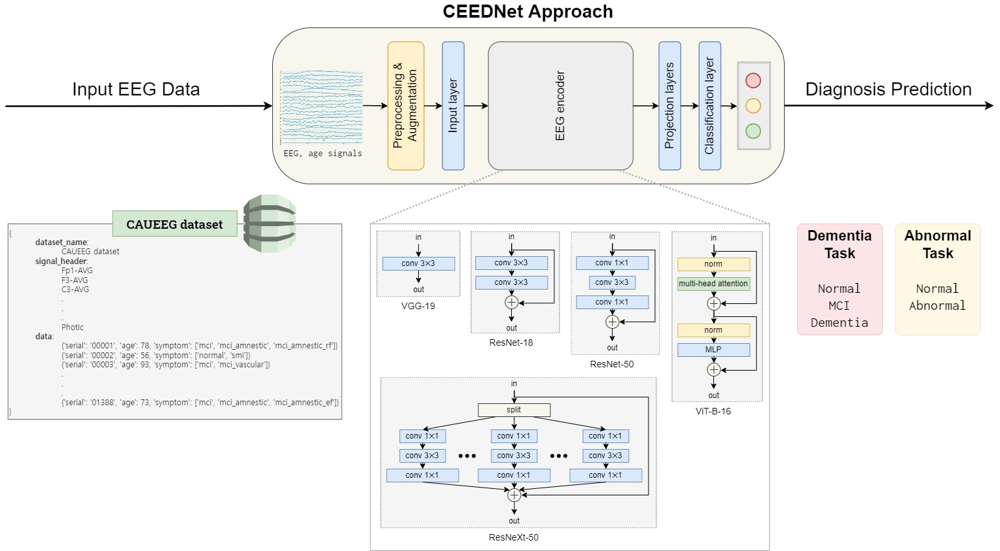
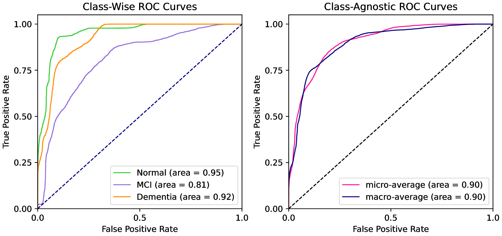
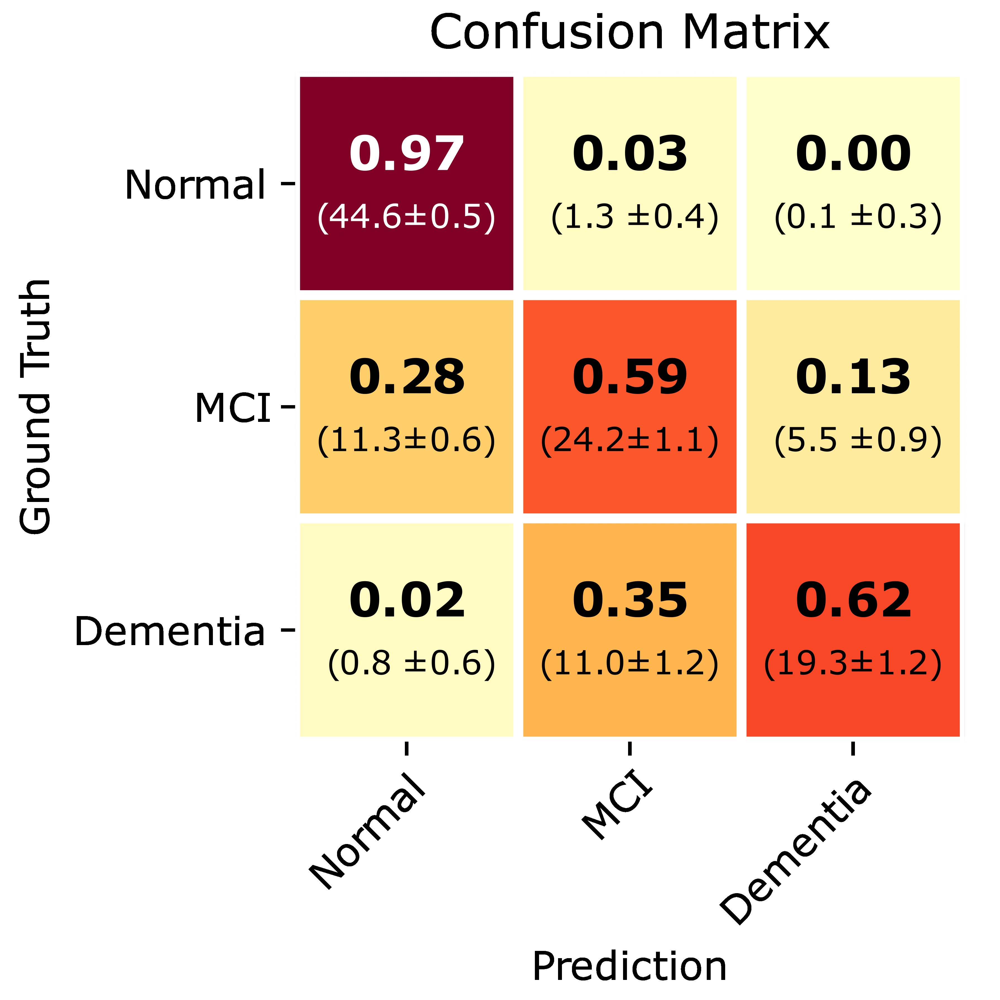
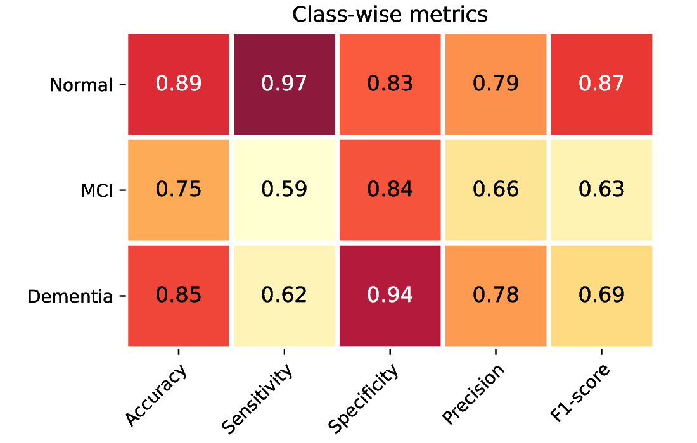
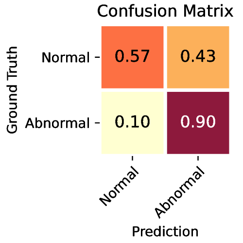
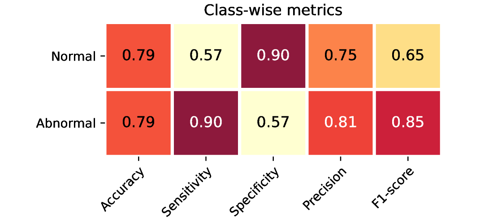

# caueeg-ceednet

**CEEDNet**: **C**AU**E**EG **E**nd-to-end **D**eep neural **Net**work for automatic early detection of dementia based on the CAUEEG dataset.

This repository is the official implementation of "Deep learning-based EEG analysis to classify mild cognitive impairment for early detection of dementia: algorithms and benchmarks."



---

## Model summary

### *CAUEEG-Dementia* benchmark

|                   Model                  | #Params | Model size (MiB) | TTA | Throughput (EEG/s) | Test accuracy |                                             Link 1                                             |                Link 2                |
|:----------------------------------------:|:-------:|:----------------:|:---:|:------------------:|:-------------:|:----------------------------------------------------------------------------------------------:|:------------------------------------:|
|         k-Nearest Neighbors (k=5)        |    -    |      11848.7     |     |        52.42       |     36.80%    |                                                                                                |                                      |
|       Random Forests (#trees=2000)       |    -    |      2932.8      |     |       808.76       |     46.62%    |                                                                                                |                                      |
|                Linear SVM                |   0.1M  |        0.5       |     |      10393.40      |     52.33%    |                                                                                                |                                      |
| Ieracitano-CNN ([Ieracitano et al., 2019](https://doi.org/10.1016/j.neucom.2018.09.071)) |   3.5M  |       13.2       |     |       8172.36      |     54.27%    |                                                                                                |                                      |
|            CEEDNet (1D-VGG-19)           |  20.2M  |       77.2       |     |       6593.80      |     64.00%    | [1vc80n1f](https://drive.google.com/file/d/1XRDbyIrjfR0C4eO7KJsJmft6u-lkYHMa/view?usp=sharing) | [1vc80n1f](http://naver.me/FqHmarN3) |
|            CEEDNet (1D-VGG-19)           |  20.2M  |       77.2       |  ✔  |       931.64       |     67.11%    | [1vc80n1f](https://drive.google.com/file/d/1XRDbyIrjfR0C4eO7KJsJmft6u-lkYHMa/view?usp=sharing) | [1vc80n1f](http://naver.me/FqHmarN3) |
|          CEEDNet (1D-ResNet-18)          |  11.4M  |       43.6       |  ✔  |       1249.90      |     68.75%    | [2s1700lg](https://drive.google.com/file/d/1LPWNm2lrW7ioQKrxo-egy4SG1bhxuIJk/view?usp=sharing) | [2s1700lg](http://naver.me/5VAZbIKU) |
|          CEEDNet (1D-ResNet-50)          |  26.2M  |       100.2      |  ✔  |       1013.18      |     67.00%    | [gvqyvmrj](https://drive.google.com/file/d/18CJcjJf8R-8_dCEYlJJlchevnLk65Fbv/view?usp=sharing) | [gvqyvmrj](http://naver.me/GaT7Jv7R) |
|          CEEDNet (1D-ResNeXt-50)         |  25.7M  |       98.2       |  ✔  |       702.64       |     68.54%    | [v301o425](https://drive.google.com/file/d/151_8TtAgmtsuUCnvs72-J2TEc6_9KNFe/view?usp=sharing) | [v301o425](http://naver.me/xPpjeZms) |
|            CEEDNet (2D-VGG-19)           |  20.2M  |       77.1       |  ✔  |       296.84       |     70.18%    | [lo88puq7](https://drive.google.com/file/d/1GYN2NrvDpiE9VB4_Lf7JdqinCCVN0jMu/view?usp=sharing) | [lo88puq7](http://naver.me/5T3Rs9BG) |
|          CEEDNet (2D-ResNet-18)          |  11.4M  |       43.7       |  ✔  |       399.40       |     65.88%    | [xci5svkl](https://drive.google.com/file/d/1SeTCuYihT18lPlKjxW8OYoMGrCAFUmVt/view?usp=sharing) | [xci5svkl](http://naver.me/59NpYBWp) |
|          CEEDNet (2D-ResNet-50)          |  25.7M  |       98.5       |  ✔  |       182.20       |     67.21%    | [syrx7bmk](https://drive.google.com/file/d/1YKGJsaGzI6wx6xLyU20jgHQ3dE4w9-ih/view?usp=sharing) | [syrx7bmk](http://naver.me/F2YWda3d) |
|          CEEDNet (2D-ResNeXt-50)         |  25.9M  |       99.1       |  ✔  |       161.25       |     67.91%    | [1sl7ipca](https://drive.google.com/file/d/1d6_5C7ZBXzYCnBoNjJmZeefXENnEcdhI/view?usp=sharing) | [1sl7ipca](http://naver.me/5vYbU1Mp) |
|            CEEDNet (ViT-B-16)            |  90.1M  |       343.6      |  ✔  |        47.31       |     66.18%    | [gjkysllw](https://drive.google.com/file/d/1ZTdU0mtMjqVvBw3tXpc-_R2GR9PhSNl6/view?usp=sharing) | [gjkysllw](http://naver.me/x6UXopG9) |
|            CEEDNet (Ensemble)            |  256.7M |       981.1      |  ✔  |        22.74       |     74.66%    |                                                                                                |                                      |





### *CAUEEG-Abnormal* benchmark

|                   Model                  | #Params | Model size (MiB) | TTA | Throughput (EEG/s) | Test accuracy |                                             Link 1                                             |                Link 2                |
|:----------------------------------------:|:-------:|:----------------:|:---:|:------------------:|:-------------:|:----------------------------------------------------------------------------------------------:|:------------------------------------:|
|         K-Nearest Neighbors (K=7)        |    -    |      14015.3     |     |        41.19       |     51.42%    |                                                                                                |                                      |
|       Random Forests (#trees=2000)       |    -    |      1930.5      |     |       830.80       |     72.63%    |                                                                                                |                                      |
|                Linear SVM                |   0.1M  |        0.3       |     |      10363.76      |     68.00%    |                                                                                                |                                      |
| Ieracitano-CNN ([Ieracitano et al., 2019](https://doi.org/10.1016/j.neucom.2018.09.071)) |   3.5M  |       13.2       |     |       8293.08      |     65.98%    |                                                                                                |                                      |
|            CEEDNet (1D-VGG-19)           |  20.2M  |       77.2       |     |       7660.22      |     72.45%    | [nemy8ikm](https://drive.google.com/file/d/1NpDsxmFMln71d9JEpnGfCxhaRtyWK4su/view?usp=sharing) | [nemy8ikm](http://naver.me/x1gdjONm) |
|            CEEDNet (1D-VGG-19)           |  20.2M  |       77.2       |  ✔  |       998.54       |     74.28%    | [nemy8ikm](https://drive.google.com/file/d/1NpDsxmFMln71d9JEpnGfCxhaRtyWK4su/view?usp=sharing) | [nemy8ikm](http://naver.me/x1gdjONm) |
|          CEEDNet (1D-ResNet-18)          |  11.4M  |       43.5       |  ✔  |       844.65       |     74.85%    | [4439k9pg](https://drive.google.com/file/d/1LH069g2oyO2XvEDzFpJPR9X5xuLmcnq3/view?usp=sharing) | [4439k9pg](http://naver.me/5vYbUTay) |
|          CEEDNet (1D-ResNet-50)          |  26.3M  |       100.7      |  ✔  |       837.66       |     76.37%    | [q1hhkmik](https://drive.google.com/file/d/1U9G0nJ-dYe6RBFxuCsdCkh-LU5AxwqFS/view?usp=sharing) | [q1hhkmik](http://naver.me/xEqsymHV) |
|          CEEDNet (1D-ResNeXt-50)         |  25.7M  |       98.2       |  ✔  |       800.49       |     77.32%    | [tp7qn5hd](https://drive.google.com/file/d/1OR5Z4U-QWDZBlm8A8pnRB2LMU0wTOMVa/view?usp=sharing) | [tp7qn5hd](http://naver.me/GItl9VHH) |
|            CEEDNet (2D-VGG-19)           |  20.2M  |       77.2       |  ✔  |       447.81       |     75.39%    | [ruqd8r7g](https://drive.google.com/file/d/1UUADOHCoBc4wt9LmIn-GitbPzNRbmCTn/view?usp=sharing) | [ruqd8r7g](http://naver.me/GkJzA84q) |
|          CEEDNet (2D-ResNet-18)          |  11.5M  |       43.8       |  ✔  |       410.44       |     75.19%    | [dn10a6bv](https://drive.google.com/file/d/12bsVV0dcVbbjO4eB3vN7ykeFAf6vp-7P/view?usp=sharing) | [dn10a6bv](http://naver.me/51nm4WtS) |
|          CEEDNet (2D-ResNet-50)          |  25.7M  |       98.5       |  ✔  |       187.30       |     74.96%    | [atbhqdgg](https://drive.google.com/file/d/1ZWnK04-o5V1eIDtlE_5Ct83oxaMfHkzX/view?usp=sharing) | [atbhqdgg](http://naver.me/5Lo4eJAa) |
|          CEEDNet (2D-ResNeXt-50)         |  25.9M  |       99.1       |  ✔  |       201.01       |     75.85%    | [0svudowu](https://drive.google.com/file/d/1A8npNb_3ixmS6ui6yTonh95oQXwPjHWp/view?usp=sharing) | [0svudowu](http://naver.me/FEdfcVaz) |
|            CEEDNet (ViT-B-16)            |  86.9M  |       331.6      |  ✔  |        63.99       |     72.70%    | [1cdws3t5](https://drive.google.com/file/d/1OT-xOTJ2kSqYWOG0KWQ6PeSPYWdX52Lo/view?usp=sharing) | [1cdws3t5](http://naver.me/xkqoPaor) |
|            CEEDNet (Ensemble)            |  253.8M |       969.9      |  ✔  |        26.40       |     79.16%    |                                                                                                |                                      |





---

## Getting started

### Requirements

- Installation of Conda (refer to <https://www.anaconda.com/products/distribution>)
- Nvidia GPU with CUDA support

> Note: we tested the code in the following environments.
>
> |    **OS**    | **Python** | **PyTorch** | **CUDA** |
> |:------------:|:----------:|:-----------:|:--------:|
> |  Windows 10  |   3.9.12   |    1.11.0   |   11.3   |
> | Ubuntu 18.04 |   3.8.11   |    1.10.0   |   11.3   |
> | Ubuntu 20.04 |   3.9.12   |    1.11.0   |   11.3   |

### Installation

(optional) Create and activate a Conda environment.

```bash
conda create -n caueeg python=3.9
conda activate caueeg
```

Install PyTorch library (refer to <https://pytorch.org/get-started/locally/>).

```bash
conda install pytorch torchvision cudatoolkit=11.3 -c pytorch
```

Install other necessary libraries.

```bash
pip install -r requirements.txt
```

### Preparation of the [CAUEEG](https://github.com/ipis-mjkim/caueeg-dataset) dataset

> ❗ Note: The use of the CAUEEG dataset is allowed for only academic and research purposes 👩‍🎓👨🏼‍🎓.

- For full access of the CAUEEG dataset, follow the instructions specified in <https://github.com/ipis-mjkim/caueeg-dataset>.
- Download, unzip, and move the whole dataset files into [local/datasets/](local/datasets/).

> 💡 Note: We provide `caueeg-dataset-test-only` at [[link 1]](https://drive.google.com/file/d/1P3CbLY7h9O1CoWEWsIZFbUKoGSRUkTA1/view?usp=sharing) or [[link 2]](http://naver.me/xzLCBwFp) to test our research. `caueeg-dataset-test-only` has the 'real' test splits of two benchmarks (*CAUEEG-Dementia* and *CAUEEG-Abnormal*) but includes the 'fake' train and validation splits.

---

## Usage

### Train

Train a CEEDNet model on the training set of *CAUEEG-Dementia* from scratch using the following command:

```bash
python run_train.py data=caueeg-dementia model=1D-ResNet-18 train=base_train
```

Similarly, train a model on the training set of *CAUEEG-Abnormal* from scratch using:

```bash
python run_train.py data=caueeg-abnormal model=1D-ResNet-18 train=base_train
```

Or, you can use [this Jupyter notebook](notebook/02_Train.ipynb).

Thanks to [Hydra](https://hydra.cc/) support, the model, hyperparameters, and other training details are easily tuned using or modifying config files.

```bash
python run_train.py data=task-dementia model=2D-VGG-19 train=base_train
```

For speed-up, we recommend using the `PyArrow.feather` file format than using directly `EDF`, which can be done:

```bash
python ./datasets/convert_file_format.py  # it takes a few minutes
python run_train.py data=task-dementia model=2D-VGG-19 train=base_train ++data.file_format=feather
```

### Evaluation

Evaluation can be conducted using [this Jupyter notebook](notebook/03_Evaluate.ipynb) (or [another notebook](notebook/03_Evaluate_Test_Only.ipynb) for `caueeg-dataset-test-only` case)

To use the pre-trained model, download the checkpoint file from [here](#model-summary), and move it to [local/checkpoint](local/checkpoint/) directory (e.g., `local/checkpoint/1vc80n1f/checkpoint.pt` for the 1D-VGG-19 model on the *CAUEEG-Dementia* benchmark).

---

## Citation

If you found this dataset helpful, please cite the paper below.

```bib
An academic paper will be upcoming soon.
```
